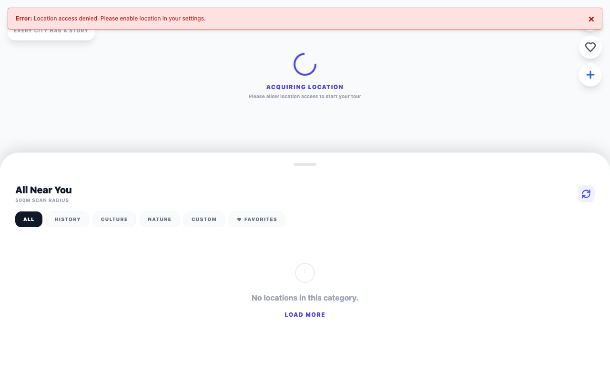

# 🎧 Audio Guide

A Nuxt app that turns a Google Map into a location-aware audio guide, using OpenAI to generate narration as you move.


*Headless browser denied the location prompt, so it's stuck on "Acquiring location" — still shows the app UI running.*

## Features

- 🗺️ **Interactive map** — built on `vue3-google-map` with marker clustering via `@googlemaps/markerclusterer`
- 🤖 **AI-generated narration** — uses the `openai` SDK and `@openai/agents` to produce guide content, validated with `zod`
- 📍 **Location-aware** — reactive map centering as the user's position changes
- 🎨 **Tailwind styling** — via `@nuxtjs/tailwindcss`

## Installation

```bash
git clone <this repo>
cd audio-guide
pnpm install
```

Set your Google Maps and OpenAI API keys as required by `nuxt.config.ts` / `.env`.

## Usage

```bash
pnpm dev
```

Dev server runs over HTTPS on your local network (`nuxt dev --host --https`) — needed for geolocation to work in the browser.

```bash
pnpm build      # production build
pnpm generate   # static generation
pnpm preview    # preview production build
```

## Built with

- [Nuxt 4](https://nuxt.com/)
- [Google Maps JavaScript API](https://developers.google.com/maps) via `vue3-google-map`
- [OpenAI API](https://platform.openai.com/) / Agents SDK
- [Tailwind CSS](https://tailwindcss.com/)

## Status

🚧 Active prototype — core map + AI narration pieces are wired up (`app/`, `server/`), but this replaces the project's original default Nuxt-starter README, so expect rough edges around error handling and API key setup.

⚠️ `pnpm install && pnpm run build` verified working as of 2026-09-03. Actual runtime features (map, narration, transcription, TTS) require your own Google Maps and OpenAI API keys in `.env`, which aren't provided here — build/typecheck succeed without them.
